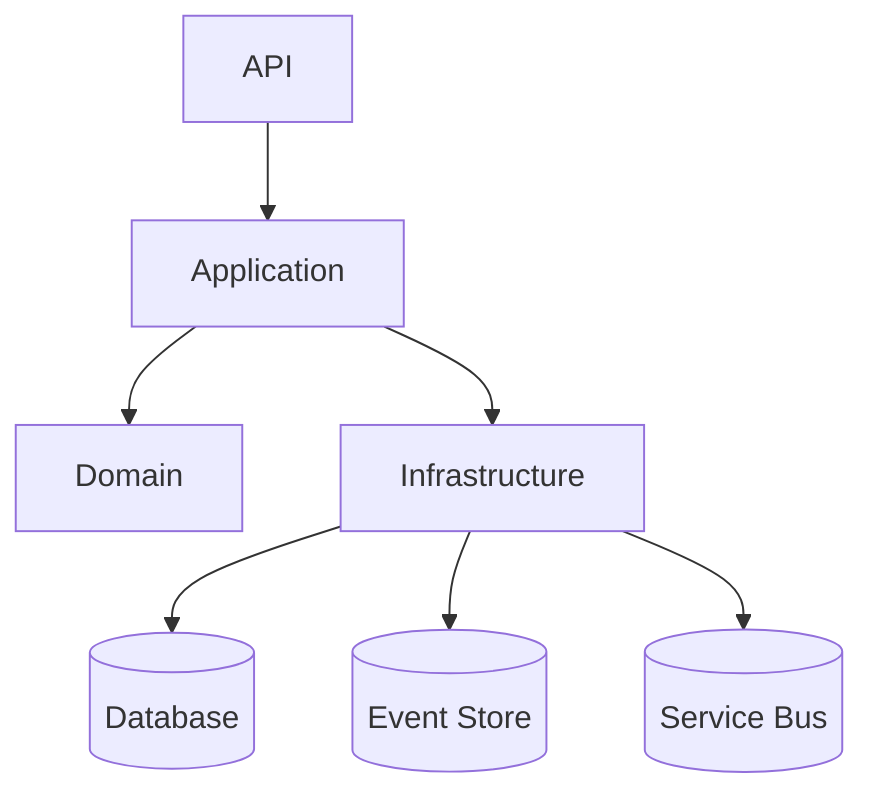

# Arquitetura - Boilerplate .NET Enterprise

## Clean Architecture

A Clean Architecture separa responsabilidades em camadas, facilitando testes, manutenção e evolução do sistema.

- **Domain:** Regras de negócio, entidades, agregados, eventos de domínio.
- **Application:** Casos de uso, CQRS, handlers, DTOs, validações.
- **Infrastructure:** Implementações técnicas (EF Core, Event Sourcing, Email, Service Bus, Logging).
- **API:** Interface HTTP, controllers, autenticação, versionamento, health checks.
- **Shared:** Utilitários, localização, constantes.

## Diagrama

## Padrões e Tecnologias

- **CQRS/MediatR:** Separação de comandos e queries, handlers desacoplados.
- **Event Sourcing:** Persistência baseada em eventos (EventStoreDB/Marten).
- **DDD:** Modelagem rica, foco no domínio.
- **Polly:** Resiliência (retry, circuit breaker).
- **Serilog + ElasticSearch:** Logging estruturado e observabilidade.
- **JWT:** Autenticação e autorização segura.
- **Multilíngue:** Suporte a localização (pt-BR por padrão).
- **Service Bus:** Integração assíncrona (RabbitMQ/Azure Service Bus).
- **Email Sender:** Exemplo de envio de e-mails via SMTP.

## Fluxo Resumido

1. Request chega na API
2. Controller chama MediatR (Command/Query)
3. Handler executa lógica (Application)
4. Domínio é manipulado (Domain)
5. Persistência via EF Core/Event Sourcing (Infrastructure)
6. Eventos publicados em Service Bus (opcional)
7. Resposta retornada ao cliente 