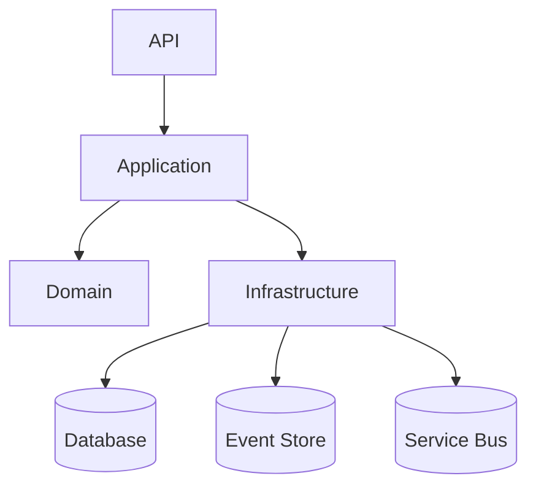

# Boilerplate .NET Enterprise Architecture

[](https://github.com/SEU_USUARIO/Boilerplate-.NET-Enterprise-Architecture/actions)
[](https://dotnet.microsoft.com/)
[](https://www.docker.com/)
[](LICENSE)

> **Adaptação para outras clouds:**
> - **AWS:** Utilize ECS/Fargate, RDS, SQS, Secrets Manager. Ajuste docker-compose para ECS e configure o deploy no workflow.
> - **GCP:** Use Cloud Run, Cloud SQL, Pub/Sub, Secret Manager. Ajuste variáveis de ambiente e pipelines conforme documentação GCP.
> - **Azure:** Pronto para Azure Web App, Azure SQL, Service Bus, Key Vault. Basta configurar secrets e deploy.

---

## Visão Geral

Boilerplate Enterprise .NET 8+ pronto para produção, multiplataforma (Linux/Windows), arquitetura moderna (Clean Architecture + DDD + CQRS + Event Sourcing), seguro, escalável e extensível. Ideal para APIs RESTful em ambientes cloud (Azure/AWS/GCP).

- **Clean Architecture, DDD, CQRS, Event Sourcing**
- **Autenticação JWT, autorização por Roles**
- **EF Core, Migrations, Seeds**
- **Health Checks, Versionamento, Swagger**
- **Serilog + ElasticSearch, Polly, Multilíngue**
- **Service Bus (RabbitMQ/Azure), Email Sender, Secrets**
- **Docker, CI/CD GitHub Actions, Testes xUnit**

---

## Estrutura de Pastas

```text
src/
  Api/            # API ASP.NET Core (Swagger, JWT, Health, Versionamento)
  Application/    # CQRS, UseCases, MediatR, DTOs, Validators
  Domain/         # Entidades, Agregados, ValueObjects, Eventos
  Infrastructure/ # EF Core, Event Sourcing, Repositórios, Email, Service Bus
  Shared/         # Utilitários, Localization, Constantes

tests/
  Unit/           # Testes unitários (xUnit)
  Integration/    # Testes de integração

docker/           # Dockerfile, docker-compose
.github/workflows/ # CI/CD
Docs/             # Diagramas, GIF, exemplos
```

---

## Pré-requisitos

- [.NET 8 SDK](https://dotnet.microsoft.com/download/dotnet/8.0) (Windows, Linux ou Mac)
- [Docker Desktop](https://www.docker.com/products/docker-desktop/) (Windows: use WSL2 se possível)
- [Git](https://git-scm.com/downloads)
- (Opcional) [Visual Studio Code](https://code.visualstudio.com/) ou [Rider](https://www.jetbrains.com/rider/)

> **Dica Windows:**
> - Certifique-se de que o Docker Desktop está rodando e com WSL2 habilitado.
> - Se aparecer erro de permissão, execute o terminal como administrador.

---

## Como rodar o projeto (Docker ou Local)

### 1. Clonar o repositório
```bash
git clone https://github.com/SEU_USUARIO/Boilerplate-.NET-Enterprise-Architecture.git
cd Boilerplate-.NET-Enterprise-Architecture
```

### 2. Rodar via Docker (recomendado)
```bash
docker-compose -f docker/docker-compose.yml up --build
```
- Acesse: [http://localhost:5000/swagger](http://localhost:5000/swagger)
- Para parar: `docker-compose -f docker/docker-compose.yml down`

### 3. Rodar localmente (sem Docker)
```bash
dotnet restore
cd src/Api
dotnet run
```
- Acesse: [http://localhost:5000/swagger](http://localhost:5000/swagger)

### 4. Variáveis de ambiente importantes
- A string de conexão já está pronta para Docker:
  ```
  Server=db;Database=BoilerplateDb;User=sa;Password=Your_password123;TrustServerCertificate=True;
  ```
- Para rodar local, use:
  ```
  Server=localhost;Database=BoilerplateDb;User=sa;Password=Your_password123;TrustServerCertificate=True;
  ```

---

## Dicas rápidas para iniciantes
- Se o SQL Server demorar para subir, aguarde alguns minutos e reinicie a API.
- Se aparecer erro de certificado, confira se `TrustServerCertificate=True` está na string de conexão.
- Se der erro de porta, altere no `docker-compose.yml` ou `launchSettings.json`.
- Para limpar tudo: `docker-compose -f docker/docker-compose.yml down -v --remove-orphans`

---

## Exemplos de Endpoints

```http
POST /api/v1/orders
GET  /api/v1/orders/{id}
GET  /health
POST /auth/login
```

Veja exemplos completos em [Docs/Examples.http](Docs/Examples.http)

---

## Arquitetura

- **Domain:** Entidades, Agregados, ValueObjects, Eventos de Domínio
- **Application:** CQRS (MediatR), UseCases, DTOs, Validadores
- **Infrastructure:** EF Core, Event Sourcing, Repositórios, Email, Service Bus, Logging
- **API:** Controllers, Versionamento, JWT, Health, Swagger
- **Shared:** Utilitários, Localization, Constantes

### Diagrama Clean Architecture



Veja mais diagramas em [Docs/Architecture.md](Docs/Architecture.md)

---

## Como rodar localmente

1. Configure variáveis de ambiente (veja `.env.example` ou use User-Secrets)
2. Rode `docker-compose -f docker/docker-compose.yml up --build`
3. Acesse o Swagger em [http://localhost:5000/swagger](http://localhost:5000/swagger)

---

## Testes

```bash
dotnet test
```

---

## CI/CD

- Pipeline GitHub Actions: build, test, deploy (exemplo para Azure Web App)
- Pronto para integração com outros clouds (ajuste o workflow conforme necessário)

---

## Features

- [x] Clean Architecture + DDD + CQRS + Event Sourcing
- [x] EF Core, Migrations, Seeds
- [x] JWT, Roles, Health, Versionamento, Swagger
- [x] Serilog + ElasticSearch, Polly, Multilíngue
- [x] Service Bus, Email Sender, Secrets
- [x] Docker, CI/CD, Testes

---

## Licença

MIT. Veja [LICENSE](LICENSE).

---

> Comentários e exemplos no código para facilitar onboarding. Sinta-se à vontade para contribuir!

---

## Onboarding Rápido
Veja o guia completo em [Docs/ONBOARDING.md](Docs/ONBOARDING.md)

---

## Exemplos de Payloads e Requests
Veja exemplos práticos em [Docs/Examples.http](Docs/Examples.http)

### Exemplo de criação de pedido
```json
POST /api/orders
{
  "customerId": "d290f1ee-6c54-4b01-90e6-d701748f0851"
}
```

### Exemplo de login
```json
POST /auth/login
{
  "username": "admin",
  "password": "admin123"
}
```

### Exemplo de envio de e-mail
```json
POST /api/email/send
{
  "to": "destinatario@exemplo.com",
  "subject": "Bem-vindo!",
  "body": "Sua conta foi criada com sucesso."
}
```

---

## Troubleshooting (Dicas rápidas)
- Erro de porta ocupada? Altere a porta no `launchSettings.json` ou no `docker-compose.yml`.
- Docker não sobe SQL Server? Verifique se o Docker Desktop está rodando e se há memória suficiente.
- Problemas de build? Rode `dotnet clean`, `dotnet restore` e `dotnet build`.
- Dúvidas sobre endpoints? Veja [Docs/Examples.http](Docs/Examples.http) ou o Swagger.

---

## FAQ Rápido
- **Docker não sobe SQL Server?**
  - Verifique se o Docker Desktop está rodando e se há memória suficiente.
  - Aguarde alguns minutos, a primeira inicialização pode ser lenta.
- **API não conecta no banco?**
  - Confirme se a string de conexão tem `TrustServerCertificate=True`.
  - Reinicie o container da API após o banco estar pronto.
- **Como acessar o Swagger?**
  - [http://localhost:5000/swagger](http://localhost:5000/swagger)
- **Como rodar só a API?**
  - `cd src/Api && dotnet run`
- **Como rodar só o banco?**
  - `docker-compose -f docker/docker-compose.yml up db`

---

## Créditos

Este projeto foi criado e mantido por **Alexsandro Nunes Lacerda**

- Site pessoal: [www.alexsandronuneslacerda.com.br](https://www.alexsandronuneslacerda.com.br)
- Instagram: [@alexsandronl](https://www.instagram.com/alexsandronl)
- LinkedIn: [@alexsandronuneslacerda](https://www.linkedin.com/in/alexsandronuneslacerda/)
